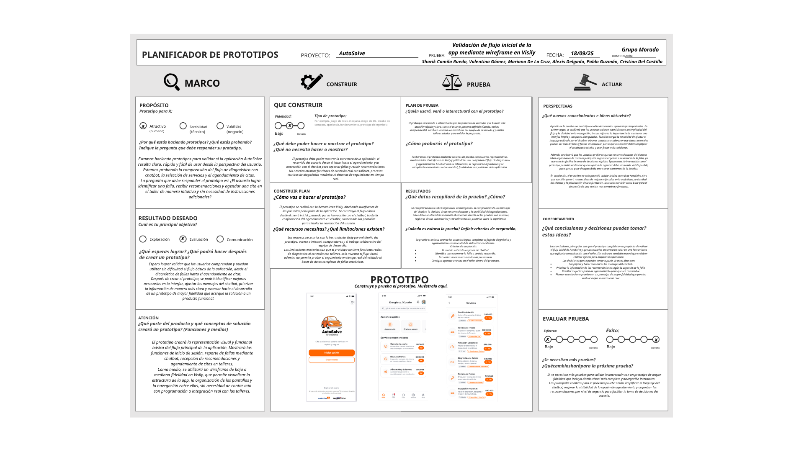

# Prototipo

El prototipo de baja–media fidelidad se construyó en Visily y se validó con usuarios
el **18/09/2025**. Este repositorio implementa ese flujo como producto funcional.

## Pantallas del wireframe

### 1. Bienvenida / Login

- Logo AutoSolve + marca *Energitéca*.
- Copy: «Cita y asistencia para tu vehículo — rápido y seguro».
- Acciones: `Iniciar sesión` (primaria, naranja sólido) / `Crear cuenta` (contorno).
- Enlace secundario: `Explorar sin cuenta`.
- Pie con logos de Coéxito y Energitéca.

### 2. Inicio

- Encabezado `Energitéca / Coéxito` con campana de notificaciones y avatar.
- Buscador: «¿Qué servicio necesitas? (ej. cambio de aceite)».
- **Acciones rápidas**: Agendar cita · Chat con asesor · Mis vehículos.
- **Servicios recomendados**: tarjeta con nombre, descripción, precio y botón `Ver`.
- Navegación inferior: Inicio · Citas · Chat · Historial · Perfil.

### 3. Servicios

Listado con ícono, nombre, descripción, precio, duración estimada y una etiqueta
de categoría (Taller Autorizado, Seguridad Vial, Rendimiento Óptimo,
Mantenimiento Preventivo, Inspección Rápida, Seguridad y Vida Útil).

| Servicio | Precio | Duración |
| --- | ---: | ---: |
| Cambio de Aceite | $80.000 | 45 min |
| Revisión de Frenos | $120.000 | 60 min |
| Alineación y Balanceo | $70.000 | 75 min |
| Diagnóstico de Batería | $35.000 | 30 min |
| Revisión de Fluidos | $25.000 | 20 min |
| Inspección de Llantas | $40.000 | 30 min |

## Hallazgos de la validación

- Los usuarios completaron el flujo diagnóstico → agendamiento sin instrucciones.
- **81.8%** asoció el diseño con confianza y profesionalismo.
- Ajustes pedidos: simplificar el lenguaje del chatbot, hacer más visible la opción
  de agendar y priorizar las recomendaciones por nivel de urgencia.

Los tres ajustes están implementados: el chatbot usa lenguaje coloquial, el CTA de
agendar aparece en acciones rápidas y en cada resultado, y las recomendaciones se
ordenan por `urgency` (`alta` → `media` → `baja`).
